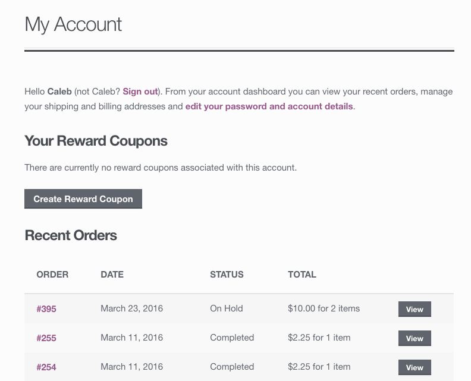
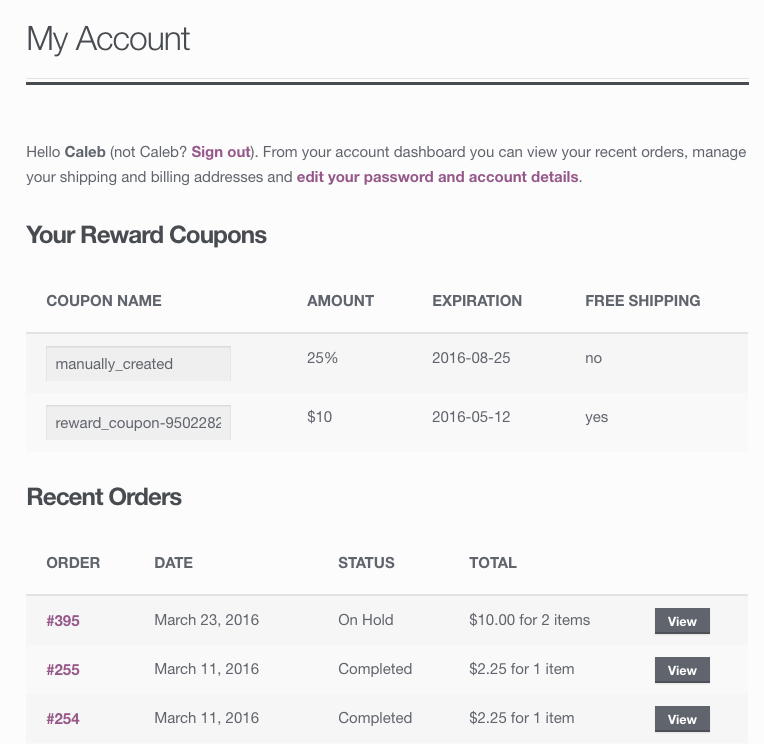
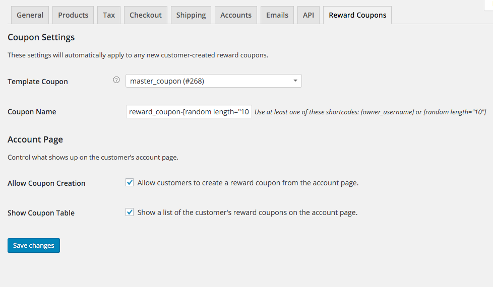
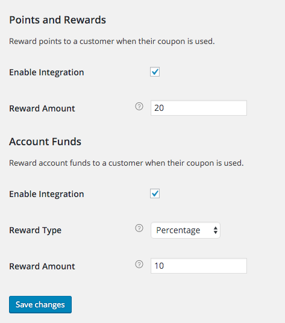

# Customer Reward Coupons for WooCommerce
Allows customers to create coupons that they can share and earn rewards from. When the reward coupon is used, you can reward the coupon owner with either Account Funds or Points.

## Documentation
### How this works
On the customer's account page, they will have the option to create a coupon. After choosing to create one, a reward coupon will be automatically generated. Now the customer will be able to see the coupon name and some details about it such as the discount amount.

This coupon can then be shared by the owner. Once it has been used by another customer, you have the choice to either reward the owner with some account funds or some points. Doing so requires either the Account Funds or Points and Rewards extension.

So in order for this to work, you need to first configure the reward coupon's default settings, and then how you want to reward the coupon owners once their coupon has been used.

### Coupon Settings
To start, go to WooCommerce > Coupons and create a new coupon as a "template" coupon. All of the settings (cost, discount type, free shipping, etc) will be copied over to the automatically generated coupons that customers can create. You can name this coupon whatever you would like, but I recommend both naming it so you remember it's purpose, but also in a way that it won't be guessed. Something like "Coupon\_Reward\_Template-3d1e8b2a2" should do the trick.

Now that you have an example coupon set up, go to WooCommerce > Settings > Coupon Affiliates and select the coupon you just created as the "Template Coupon". The only coupon setting left now is how you would like the reward coupons to be named. Each coupon needs to have a unique name, so there are two shortcodes that can be used while naming the coupon. The shortcodes are [owner\_username] and [random length="10"]. The first will grab the owners's account username. For example, [owner\_username]-coupon will become "johns-coupon" if the owner's account username is "john". The other shortcode will generate a random string of letters and numbers. You can choose a length between 1 and 40, but remember that you need each coupon to be different.

### Account Page Settings
Select if you would like customer's to be able to create coupons from their account page, and also if you would like their coupons to be shown on the account page.

### Reward Settings
Account Funds:

Choose if you want to reward the coupon's owner with a flat rate fund for each time the coupon is used, or if you would like to reward them funds based on a percentage of the order total.

Points and Rewards:

Select how many points you would like the coupon's owner to earn each time their coupon is used.

## Screenshots

Create a reward coupon:

View reward coupons:

Plugin Settings:

Integrations:

